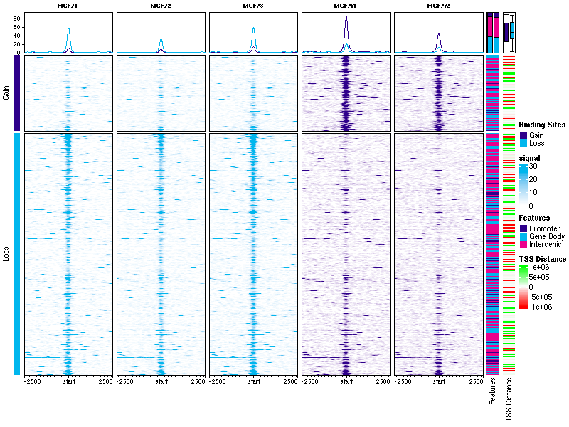

```{css, echo=FALSE}
.infobox {
  padding: 1em 1em 1em 4em;
  margin-bottom: 10px;
  border: 2px solid #008000;
  border-radius: 10px;
  background: #DCDCDC 5px center/3em no-repeat;
  color: #8B0000;
}
.center {
  text-align: center;
}
```

```{r, setup, include=FALSE}
library(knitr)
knitr::opts_chunk$set(out.width="100%", cache=TRUE)
knitr::opts_knit$set(root.dir="../inst/extdata")
```

<br><br><br><br>

# Workshop participation

<br>

Instructions on how to run and follow along during the workshop.

## Workshop participation -- local Docker image

If you **not** are already logged into an RStudio instance provided by the conference
organizers, and you have a Docker client installed on your machine,
you run this workshop locally via:

```
docker pull crukcibioinformatics/quantitative_chip_workshop:latest
docker images
docker run -e PASSWORD=DiffBind -p 8787:8787 <imageid> 
```
Then open a browser and go to the URL **localhost:8787**.
Log into RStudio with **username:rstudio** and **password:DiffBind**.

**NOTE**: *The workshop Docker instance does not have much compute power.*
*As a result, it is not possible to run all the code in the time allowed.*
*Two operations are affected: building greylists, and counting reads.*
*In these cases, the workshop includes pre-computed data objects that*
*can be loaded to avoid the time-consuming code.*
*This is noted inline.*

## Workshop participation -- local R installation

The workshop uses a Docker container with Bioconductor Release version `3.12`.
If you would like to install Bioconductor on your computer **at a later date**,
see the [Bioconductor installation](https://www.bioconductor.org/install)
instructions.

Here is a list of packages that we will be using:

```{r loadpackages, message=FALSE}
library(DiffBind)
library(GreyListChIP)
library(csaw)
```

## How to follow the workshop

First load the workshop package:

```{r loadworkshop, eval=FALSE}
library(QuantitativeChIPseqWorkshop)
```

There are a number of ways to follow the workshop:

### Follow the workshop in the pre-built HTML in RStudio
You can open the fully built workshop (with all code and results) in
the "Help" pane in RStudio as follows:

```{r workshoppane, eval=FALSE}
vignette("Quantitative-ChIPseq-Workshop","QuantitativeChIPseqWorkshop")
```

### Follow the workshop in the pre-built HTML in a searate Browser window or tab
If you are using the Docker image,
You can open the fully built workshop (with all code and results) in
a browser tab as follows:

```{r workshopbrowser, eval=FALSE}
rstudioapi::viewer(paste(system.file("doc",
                                     package="QuantitativeChIPseqWorkshop"),
                         "Quantitative-ChIPseq-Workshop.html", sep="/"))
```

It may be helpful to move the tab into its own window so you can see the vignette and the RStudio window at the same time.

### Follow the workshop directly in the workshop mark-down file

You can open the workshop "source" .Rmd file in the RStudio
"Source" pane, and follow along, 
executing each code chunk in sequence, to build it as you go.

```{r workshopsource, eval=FALSE}
file.edit("vignettes/Quantitative-ChIPseq-Workshop.Rmd")
```

### Set directory to where the data are

First make sure your current working directory is correct:

```{r showdir, echo=FALSE}
getwd()
```

The directory should be `"/home/rstudio/inst/extdata"`.
If it is not, change the working directory:

```{r chrdir, eval=FALSE,echo=TRUE}
setwd("inst/extdata")
```

<br><br><br><br>

# Loading an experiment into `DiffBind`

<br>

The first step in a quantitative analysis is setting up the experiment
so that `DiffBind` has all the information it needs.
For many projects, this can be the most time-consuming step!

## What do you need to do a quantitiative analysis of an experiment?

In order to run an quantitative analysis, all the experimental data
must be ready. 
This includes three types of data:

### Sample metadata

An experiment is based on a number of **samples**. 
Each sample needs a unique **SampleID**.
A comparative analysis requires that the samples are associated
with at least two classes that can be compared.
The classes the samples belong to are indicated by associated samples *metadata*,
which can include:

* **Factor** - for ChIPs, this is usually what protein the antibody was 
targeting, such as a transcription factor or a histone mark.
* **Tissue** - a designation for the cell type, tissue type, or some other
indication of the biological source of the material.
* **Condition** - an experimental condition, such as WT or Mutant.
* **Treatment** - an indication of how the cells were treated.

Note that not all of these are required, but there should be at least one
metadata factor to divide the samples into classes.

Finally it is imperative that the experimental classes be represented by 
**Replicate** samples.
*It is not possible to perform a meaningful quantitative analysis 
without replicated data to capture variance.*
Generally a minimum of three replicates are required to obtain meaningful results.

### Aligned sequencing read data

The second type of data needed for an analysis are aligned sequencing reads,
generally in the form of '.bam' files.
Each sample needs an aligned sequencing library, but may include the following:

* **bamReads** - the primary aligned reads for the ChIP, ATAC, or other assay.
* **bamControl** - an optional set of control reads associated with the sample
or sample class. For ChIP experiments, this is most often an Input control
(ChIP run without an antibody), or a ChIP run with a non-specific antibody. 
ATAC experiment usually do not have a control.
* **SpikeIn** - an option set of spike-in reads for normalization.

### Called peaks

The type of analysis we are discussing today requires that a peak caller 
(such as **MACS**) has been used on the aligned reads to call peaks.
While having called peaks for the sample is useful in a variety of ways,
it is possible to perform a quantitative analysis without 
using called peaks.
For example, in some cases, the regions of interest may be known in advance 
(such as a list known gene promoters).
An alternative is to perform a quantitative analysis using windows that cover
the entire genome. 
The `csaw` package [@lun2016csaw] provides a tool to perform such an analysis.

## Making a samplesheet

The easiest way to set up an experiment for analysis in `DiffBind`is to use
a *sample sheet*. 
This can take the form of a `.csv` file, or a `dataframe`.

We can read in the sample sheet provided for the example data set:

```{r samplesheet}
samples <- read.csv("tamoxifen.csv")
samples
```

Here we see the example ChIP-seq data set used for this tutorial.
It consists of 11 samples, all ChIPed for the same factor 
(ER, the estrogen receptor).
There are four breast-cancer cell lines involved, representing
two experimental conditions:
cells that either `Responsive` to the drug tamoxifen, or those that
are `Resistant` to tamoxifen. 
Note that one cell line (MCF7) is marked as being both `Responsive`and `Resistant`;
these cells are naturally `Responsive`, but a `Resistant` version has
been derived by treating with tamoxifen until only resistant cells remain.
The goal of the experiment is to examine changes in ER binding patterns
between the two conditions.

There are seven `Responsive` replicates, encompassing three 
different cell lines, with two or three replicates for each `Responsive`cell line.
There are four replicates of `Resistant` samples in two cell lines,
each with two replicates.
For each sample we have a set of aligned reads (note that only reads aligned
to chromosome 18 are included to speed up the example analysis),
and an Input control is available for each cell line/condition combination.

Peaks are included in `.bed` format (they were originally called 
using `MACS` [@zhang2008model].)

## Loading the experiment into `DiffBind`

At this point a complete default end-to-end analysis could be
run using a single command (**Do not run this code during the workshop!**): 

```{r oneshot, eval=FALSE}
result <- dba.analyze(samples)
```

Instead, we are going to walk through each of the steps
of the analysis one at a time.

First load the experiment into `DiffBind` either by supplying the original
`.csv` file or using the loaded `samples` dataframe:

```{r loadsamples, collapse=TRUE}
tam.peaks <- dba(sampleSheet="tamoxifen.csv")
```

This creates a `DBA` object we've called `tam.peaks`, which can be examined:

```{r showtam}
tam.peaks
```

This shows the metadata for the 11 samples, along with how many called peaks
were included for each. 
After loading, overlapping peaks are merged; there are a total
of 3,795 unique regions specified, with 2,845 of them overlapping peaks
called in at least two samples.

<br><br><br><br>


# Blacklists and greylists

<br>

Now that the peaks are loaded, it is good practice to filter out
peaks called in problematic regions.
This is accomplished using a standard, published `Blacklist` of areas in 
in reference genome known to be problematic.
The best known lists have been identified
as part of the ENCODE project [@amemiya2019blacklist] and are
available for a variety of reference genomes and genome versions.
The current ENCODE blacklists are available through
the `dba.blacklist()` function.

In addition, if control alignments are available for an experiment,
experiment-specific exclusion lists can be generated reflecting
the tissue and experimental conditions used.
We call these `Greylists`, and thet are generated using
the `GreyListChIP`package [@brown2015greylistchip].
The idea is to analyze libraries that are not
meant to show systematic enrichment (such as Inputs, in which no
anti-body is introduced), and identify anomalous regions
where a disproportionate degree of signal is present.

## Applying a blacklist

If an ENCODE blacklist exists for the reference genome used to
align the experimental data, it can be applied
automatically using the `dba.blacklist()` function.
The reference genome is automatically detected from the supplied
`.bam` files.

```{r blacklist, collapse=TRUE}
dba.blacklist(tam.peaks, blacklist=TRUE, greylist=FALSE)
```

This shows that the blacklist filtered out one merged peak that had been 
called in three of the samples.

## Generating and applying a greylist

Greylists can be automatically generated from the controls as
`DiffBind` provides an interface to the `GreyListChIP` package.
This can be a time-consuming operation, as each of the controls is analyzed for anomalous regions.

The blacklist can be applied, and the greylists generated and applied, in 
a single step 
*NB: This is a compute-intensive step that takes too long to run in the workshop*
*Docker instance;* **do not run the following chunk** *if you are using the*
*workshop Docker image*:

```{r greylist, eval=FALSE}
tam.peaks <- dba.blacklist(tam.peaks)
```
```{r greylistout, eval=FALSE}
## Genome detected: Hsapiens.UCSC.hg19
## Applying blacklist...
## Removed: 3 of 14102 intervals.
## Counting control reads for greylist...
## Building greylist: reads/Chr18_BT474_input.bam
## coverage: 166912 bp (0.21%)
## Building greylist: reads/Chr18_MCF7_input.bam
## coverage: 106495 bp (0.14%)
## Building greylist: reads/Chr18_T47D_input.bam
## coverage: 56832 bp (0.07%)
## Building greylist: reads/Chr18_TAMR_input.bam
## coverage: 122879 bp (0.16%)
## Building greylist: reads/Chr18_ZR75_input.bam
## coverage: 72704 bp (0.09%)
## BT474c: 58 ranges, 166912 bases
## MCF7c: 14 ranges, 106495 bases
## T47Dc: 11 ranges, 56832 bases
## TAMRc: 10 ranges, 122879 bases
## ZR75c: 15 ranges, 72704 bases
## Master greylist: 72 ranges, 255487 bases
## Removed: 420 of 14099 intervals.
## Removed: 52 merged (of 3795) and 50 (of 2845) consensus.
```

**To save time**, greylists for the example data set are included,
and we can apply them directly:

```{r loadgrey}
data(tamoxifen_greylist)
names(tamoxifen.greylist)
```

In this object, there is a "master" greylist formed from the 
individual greylist (computed one per control):

```{r greymaster}
tamoxifen.greylist$master
names(tamoxifen.greylist$controls)
```

Now we can apply it:

```{r applygrey, collapse=TRUE}
tam.peaks <- dba.blacklist(tam.peaks, greylist=tamoxifen.greylist)
```

The greylist results in 52 merged peaks being filtered out 
(50 in the at-least-two-sample consensus), 
representing some 420 of the originally supplied peaks.

<br><br><br><br>


# Consensus peaks sets and counting reads

<br>

The central vehicle for conducting a quantitative analysis is a *binding matrix*,
with rows representing genomic intervals, columns representing samples, 
and values representing overlapping read counts (similar to an expression matrix
in RNA-seq). 
To compute this, we need to define the rows in the form of a *consensus peak set*.

## Consensus peak set

One straightforward way to determine the consensus peaks is to consider
genomic intervals that are identified as peaks in one or more of the samples.
It can be helpful to make a plot of how many peaks overlap in how many samples:

```{r rateplot}
olap.rate <- dba.overlap(tam.peaks, mode=DBA_OLAP_RATE)
olap.rate
plot(olap.rate, xlab="Overlapping samples", ylab="Overlapping peaks", type="b")
```

This shows that there are `r olap.rate[1]` total merged
peaks, representing the union of all intervals. 
At the other extreme, there are `r olap.rate[11]` peaks that overlap
in all 11 samples, representing the intersection of all the samples.

Which should we chose? Given the rigor of the underlying statistical analysis,
we can choose a more inclusive consensus set. 
The default is to make the consensus peak set using peaks identified in at least
two samples (`r olap.rate[2]`).

More complex schemes, such as forming a consensus peak set separately from
the replicates for each condition and then taking the union of these, are
also possible.

The default consensus peak set, which includes merged peaks that overlap in
at least two samples, can be retrieved:

```{r consensus}
consensus.peaks <- dba.peakset(tam.peaks, bRetrieve=TRUE)
consensus.peaks[,0]
```

## Counting overlapping reads

The next step is to form the binding matrix using the consensus peak and
computing overlapping read counts for each peak in each sample,
*whether or not it was called as a peak in that sample.*

The function used to accomplish this is `dba.count()`:
*NB: This is a compute-intensive step that takes too long to run in the workshop*
*Docker instance;* **do not run the following chunk** *if you are using the*
*workshop Docker image*:

```{r count, eval=FALSE}
tam.counts <- dba.count(tam.peaks)
```
```{r countout, eval=FALSE}
## Computing summits...
## Re-centering peaks...
## Reads will be counted as Single-end.
```

You can, alternatively, obtain the results as follows:
```{r loadcounts}
data(tamoxifen_counts)
tam.counts <- tamoxifen
```

`dba.count()` takes a number of parameter to control it's default behavior.
Here is a list of some important ones:

* **peaks** accepts a consensus peak set. We could have used the peak set 
retrieved above by specifying `peaks=consensus.peaks`. 
* **summits** activates a two-stage counting process. In the first stage,
a "summit" is computed for each peak based on the read pileups at each base
for each sample the peak was called in. The peak intervals are then re-specified
to be a constant interval upstream and downstream of this summit. 
The default of `summits=200`, intended for ChIP-seq, results in 401bp peaks 
(The summit point plus 200bp in each direction). 
In the second phase reads are re-counted overlapping these intervals.
* **filter** will eliminate consensus peaks with lower than a set threshold
of counts. The default `filter=1` will filter consensus peaks where there is
not at least one sample whose RPKM (reads per kilobase per million reads) 
is greater than 1.
* **bRemoveDuplicates** controls how duplicate alignments (multiple
reads mapping to the exact same genomic position) are handled. 
The default `bRemoveDuplicates=FALSE` will keep and count duplicates,
as DNA enrichment assays often include biologically meaningful
duplicate reads (especially when using short read or single-end sequencing).
* **mapQCth** sets a threshold for ignoring low-quality alignment.
The default value of `mapQCth=15` results in all multi-mapped reads
(reads that can map to multiple locations in the genome) being ignored.

After counting the reads, the DBA object reflects the consensus peak set
rather than the original peak data:

```{r countobject}
tam.counts
```

Now all eleven samples have counts for all 2,845 consensus sites.
Two columns have been added to the display, showing the total number
of aligned `Reads` in each `.bam`file, and 
the Fraction of Reads in Peaks (`FRiP`) representing the proportion
of reads that were counted as overlapping a consensus site.

## Examining and normalizing the binding matrix

At this stage it is worth looking more closely at certain
aspects of the binding matrix in preparation for normalization and modeling.

### Plots to look for a batch effect
Of particular interest is the presence of technical
effects in the experiment, such as batch effects.

We can look at how the samples cluster using heatmaps and PCA plots.
A correlation heatmap (in which correlations values
between each pair of columns in the binding matrix is calculated)
can be shown using `dba.plotHeatmap()`, which is also the
default plot:

```{r counthm}
plot(tam.counts)
```

This shows a very high correlation between the replicate for each sample type,
which indicates that there is not a large batch effect.
The main clustering divides the samples into those derived from the
MCF7 cell line, which are all highly correlated,
with the other cell lines clustering together.
At this point, we do not see a natural clustering into
tamoxifen `Responsive` and `Resistant` clusters.

We can verify that there  is no obvious batch effect with
a PCA plot:

```{r countPCA}
dba.plotPCA(tam.counts,DBA_REPLICATE, label=DBA_TISSUE)
```

### Normalization (deault)

The next step is to normalize the data.
Normalization of ChIP and ATAC sequencing data is not always straightforward,
especially compared to normalization of RNA-seq data.
We will look more closely at these issues in a subsequent section.
For now we will use the default normalization in `DiffBind`,
which makes minimal assumptions about the data and seeks to "do no harm". 

First let's make an MA plot of the date before normalization.
An MA plot shows how the fold changes between conditions are distributed
as the mean concentration of reads counts increases.
For this plot, we'll compare use the sample sin the `Responsive`condition 
as the baseline, and see how the samples in the
`Resistant`condition compare.

```{r maraw}
dba.plotMA(tam.counts, bNormalized=FALSE, sub="Non-Normalized",
           contrast=list(Resistant=tam.counts$masks$Resistant,
                         Responsive=tam.counts$masks$Responsive))
```
In this plot, each of the consensus site is a point (smoothed),
while the the X-axis orders them according to the mean number of  
overlapping read counts for the consensus site,
and the Y-axis shows the log2 fold change.
Points above the 0-fold line (blue) demonstrate greater enrichment of reads in
the `Resistant`condition, while point below the 0-fold line
are more enriched int he `Responsive` condition.
The red curve is a loess fit showing the overall trend in the data.

This plots shows that in the raw data, the `Responsive` condition samples
have overall higher concentration of overlapping reads in consensus peaks.
This could either be a technical bias, or an indication that there
is a loss of ER binding in the tamoxifen resistant condition.

By default, `DiffBind` normalizes only using the full library sizes
of the samples (total aligned reads in the `.bam`).
Perform a default normalization and see how the plot changes:
```{r normdef}
tam.counts <- dba.normalize(tam.counts)
dba.plotMA(tam.counts, sub="Normalized (Default)",
           contrast=list(Resistant=tam.counts$masks$Resistant,
                         Responsive=tam.counts$masks$Responsive))
```

Compared to the non-normalized data, the fold changes are somewhat more balanced
and moved closer to the central 0-fold line, although the loess fit
shows there is still a bias towards greater enrichment in the 
`Responsive` condition.

We will consider normalization in more depth after modeling the data,
as it is useful to consider
the impact of normalization on the modeling results.

<br><br><br><br>


# Modeling and testing

<br>

The core differential analysis in `DiffBind`is performed by one or
more underlying read count modeling Bioconductor packages.
The default package is `DESeq2` [@Love2014]; 
the `edgeR` package [@Robinson:2010p249] may be also used either as an
alternative or in parallel.
These packages, developed for modeling RNA-seq read counts, enable GLMs
to be fit.

## Default model

The `DiffBind` function `dba.contrast()` is used to specify the model
and establish contrasts to be tested against the model.
A default model and contrasts(s) can easily be established
(note we explicitly specify that the baseline 
Condition should be `Responsive`):

```{r modeldef}
tam.model <- dba.contrast(tam.counts,
                          reorderMeta=list(Condition="Responsive"))
tam.model
```

The default model is based on observing that there is only
one metadata field, `Condition`, that has a) multiple values and
b) at least three samples having each value.
A design formula is established using this factor 
and a contrast comparing `Resistant` samples against the `Responsive` samples,
with four samples in the `Resistant` condition 
and seven samples in the `Responsive` condition.

## Fitting and testing

With the design formula in place, and a contrast established,
the model can be fit with `DESeq2` and tests applied for the contrast:

```{r analyze, collapse=TRUE}
tam.model <- dba.analyze(tam.model)
dba.show(tam.model,bContrasts=TRUE)
```

At the default threshold of `FDR < 0.05`, 
some `r dba.show(tam.model,bContrasts=TRUE)$DB.DESeq2`
sites are identified as being differentially bound.

<br><br><br><br>


# Examining analysis results

<br>

After conducting an analysis, the results can be examined
in a number of ways, including obtaining a report with the
differential sites, as well as some useful plots.

## Reporting: obtaining differential sites

The differential sites may be retrieved as a `GRanges` object:

```{r report}
tam.db <- dba.report(tam.model)
tam.db
```

For each site, the genomic interval is reported, as well as the
key statistics:

* **Conc**: Mean concentration of (normalized) reads across all samples,
reported as a log2 value.
* **Conc_Resistant**: Mean concentration of (normalized) reads across the
`Resistant` samples, reported as a log2 value.
* **Conc_Responsive**: Mean concentration of (normalized) reads across the
`Responsive` samples, reported as a log2 value.
* **Fold**: Log2 Fold Change, as computed by `DESeq2`.
* **p-value**: p-value for the comparison, as computed by `DESeq2`.
* **FDR**: multiple-testing corrected significance value for the comparison, 
as computed by `DESeq2`.

We can look at the balance between Gain and Loss sites:

```{r gainloss}
sum(tam.db$Fold>0)
sum(tam.db$Fold<0)
```

The report object can now be used for downstream analysis,
such as motif analysis, annotation to genomic features, etc.

## Plotting: MA plot

After an analysis, it is useful to generate an MA plot
with the differential sites superimposed:

```{r macontrast}
dba.plotMA(tam.model)
```

## Plotting: Volcano plot

Similar to an MA plot, a volcano plot shows the log fold change 
(on the X-axis instead of the Y-axis), compared to the
inverse of the FDR on the Y-axis, to show how FDR and LFC are related:

```{r volcano}
dba.plotVolcano(tam.model)
```

## Plotting: Clustering correlation heatmap

We can also re-visit the clustering plots we originally did
on the full binding matrix, except this time only
taking differential sites intro consideration:

```{r corhmcontrast}
plot(tam.model, contrast=1)
```

As we would hope, the differential sites separate the samples
into two clusters, one `Resistant` and one `Responsive`.  

## Plotting: PCA plot

Likewise, a PCA plot based only on the differential sites
shows how the samples can be separated by condition:

```{r pcacontrast}
dba.plotPCA(tam.model, contrast=1, label=DBA_TISSUE)
```

## Plotting: Read concentration heatmap

In addition to the correlation heatmap, a plot showing
the read concentrations can also be generated. 
In this case we scale the read concentrations
for each site, to emphasize the difference
between the lowest and highest values:

```{r hmcontrast, fig.height=7}
hmap <- colorRampPalette(c("red", "black", "green"))(n = 13)
readscores <- dba.plotHeatmap(tam.model, contrast=1, correlations=FALSE,
                              scale="row", colScheme = hmap)
```

<br><br><br><br>


# Multi-factor design

<br>

The default design and contrasts may not be the correct ones,
as they may not be focused on the factors of interest.
In the current case, it turns out that it is important
to use a multi-factor design in order to model
the use of different cell lines with each condition,
and most importantly the fact that a single cell origin (MCF7)
is used across conditions.

In the current case, we will change the model to the
"correct" multi-factor design before proceeding:

```{r modelmulticon, collapse=TRUE}
tam.model <- dba.contrast(tam.model, design="~Tissue + Condition")
```
```{r modelmultishow, collapse=TRUE}
dba.show(tam.model,bDesign=TRUE)
```
```{r modelmultianal, collapse=TRUE}
tam.model <- dba.analyze(tam.model)
```
```{r modelmultifinal, collapse=TRUE}
tam.model
```

With the multi-factor model taking into account the underlying
tissue types, we now identify
`r dba.show(tam.model,bContrasts=TRUE)$DB.DESeq2`
differential sites at the default threshold of `FDR < 0.05`.
The resulting MA plot shows these are biased towards
loss of binding the in `Resistant` condition:

```{r mamulti}
dba.plotMA(tam.model, contrast=1)
```

<br><br><br><br>

# Normalization discussion

<br>

Normalization of experimental data is particularly important in ChIP-seq
(and ATAC-seq) analysis, and may require more careful consideration than
needed for RNA-seq analysis. 
This is because the range of ChIP-seq experiments covers more
cases than RNA-seq, which usually involve a similar set of possible
expressed genes and/or transcripts, many of which are not
expected to significantly change expression.
ChIP, ATAC, and similar enrichment-based sequencing data may
not follow the assumptions inherent in popular methods for normalizing
RNA-seq data, as well as exhibiting different types
of efficiency and other biases.

## Core normalization methods

The default normalization method in `DiffBind` is to look only
at the relative library sizes (number of aligned reads) 
of the experimental samples.
Why don't we use the underlying analysis methods inherent in
the `DESeq2` (RLE) and `edgeR` (TMM) differential analysis packages?

Consider the sample experiment. 
We saw in the first two MA plots that there was a bias towards greater
read concentration in the `Responsive` condition; 
this was reduced somewhat, but still remained, after library-size
normalization, and the  analysis identified
more differential sites that gained binding in the `Responsive` condition
(also seen as binding loss in the `Responsive` condition:)

```{r norm2maplots1} 
dba.plotMA(tam.model,bNormalized=FALSE, th=0, sub="Non-Normalized")
dba.plotMA(tam.model,bNormalized=TRUE, sub="Normalized: Library Size")
```

Let's see what happens if we normalizing using the "native" 
method in `DESeq2`, RLE:

```{r normRLERiP, collapse=TRUE} 
tam.model <- dba.normalize(tam.model, normalize="RLE")
tam.model <- dba.analyze(tam.model)
dba.plotMA(tam.model,bNormalized=TRUE, sub="Normalized: RLE [RiP]")
```

The result is quite different!
The read concentrations are closely balanced and fit near the 
zero log fold change line. 
The differential sites are also more balance between those losing
and gaining affinity in the `Resistant` condition:

```{r normgainloss} 
rep <- dba.report(tam.model)
sum(rep$Fold < 0)
sum(rep$Fold > 0)
```

What accounts for the difference? 
Which is the "correct" analysis?

## Reference reads

It turns out that for the type of data we are dealing with in
DNA enrichment assays, the reads that are used as the reference
for normalizing are more important that the  normalization method itself.
While in RNA-seq experiments the expression matrix can be normalized
directly, based on the reads that uniquely overlap genes or transcripts
(known as "Reads-in-Peaks", or "RiP"),
this does not apply to a binding matrix based on a consensus peakset.

In a non-peak bases analysis such as is done using 
the `csaw` package[@lun2016csaw],
where there is no consensus binding matrix, this issue
was addressed by using a large "bins" of reads across the genome.
The idea is that the bins, being so much larger in size than
binding sites or stretches of open chromatin, contain mostly
"background" reads, and present a less biased way of providing
a read count matrix on which to base normalization calculations.
This "background" method is included in `DiffBind`
*NB: This is a compute-intensive step, however if you have loaded the*
*pre-computed counts, these already include the background reads*
*so this operation may be safely run*:

```{r normbackground, eval=TRUE}
tam.model <- dba.normalize(tam.model, normalize="RLE",
                           background=TRUE)
```
```{r normRLbackground, collapse=TRUE} 
tam.model <- dba.analyze(tam.model)
dba.plotMA(tam.model,bNormalized=TRUE, sub="Normalized: RLE [Background]")
```

This yields result that more closely match those obtained using
the default library-size based normalization.

## Comparison of normalization and reference reads methods

It is interesting to compare the impact of six different normalization schemes:

1. Library size normalization based on total aligned reads (`lib_full`)
2. Library size normalization based on Reads in Peaks (`lib_RiP`)
3. RLE (native to `DESeq2`) normalization based on Reads in Peaks (`RLE_RiP`)
4. RLE (native to `DESeq2`) normalization based on background bins (`RLE_BG`)
5. TMM (native to `edgeR`) normalization based on Reads in Peaks (`TMM_RiP`)
6. TMM (native to `edgeR`) normalization based on background bins (`TMM_BG`)

There is an R script in the `inst/scripts` directory 
called `compare_norm.R`, that performs
all six of the normalization schemes, performs a `DESeq2` analysis on each,
and collects the differential sites into a report-based DBA object
that can be loaded as follows:

```{r loadcompnorm, collapse=TRUE }
norm.comp <- dba.load("norm_comp")
norm.comp
```

We can look at the differences in a couple of ways.
One is to consider how closely correlated are the resulting differential sites:

```{r normcorplot, fig.height=7}
cor <- dba.plotHeatmap(norm.comp)
```

This shows how the results cluster.
While all the analysis have a core sets of sites in common 
(the lowest correlation between analyses is `r min(cor)`,
there are two distinct clusters driven not by the normalization methods,
but by the choice of reference reads.
One cluster uses *all* the reads 
(background bins `BG` or full library size `full`),
while the other cluster normalizes based only on reads in the
binding matrix (`RiP`).
The least important difference is the choice of normalization methods:
`edgeR`'s TMM method and `DESeq2`'s RLE method produce essentially
the same results when using the same reference reads.

Next we can look at differences in the differential sites themselves
by plotting a heatmap of the log fold changes (LFC) of each site:
```{r normheatmap, fig.height=7}
hmap <- colorRampPalette(c("red", "black", "green"))(n = 7)
dba.plotHeatmap(norm.comp, correlations=FALSE, 
                bLog=FALSE, colScheme=hmap, 
                minval=-4, maxval=4,
                key.title = "LFC", main = "DESeq2 Differentially Bound Sites")
```

Sites in green are ones that Gain binding intensity in the `Resistant` condition,
while those in red lose binding intensity.
Sites in black are ones that are not identified in a specific analysis.
This plot again shows how the analyses cluster first by
the choice of reference reads, but also shows how the balance of sites
changes, with one cluster identifying mostly Loss (red)
sites, and the other `RiP` cluster identifying many more Gain sites.

The biological conclusions one might reach could be quite different
depending on which normalization scheme is chosen.

## Spike-ins and parallel factors 

While it is beyond the scope of this workshop, it is worth nothing
that alternative sets of reference reads can be used.
`DiffBind` supports the use of spike-ins, where the reads
used to normalize the libraries are based on those aligned
to exogenous chromatin  (eg. from *Drosophila melanogaster*), 
or are identified as peaks associated with a factor or mark
that is known to not change under the experimental conditions.
See the `DiffBind` vignette, and help page for `dba.normalize()`,
for guidance on how to perform such normalization.

<br><br><br><br>

# Sneak peak: Profile Plots (coming in `DiffBind 3.2`)



<br><br><br><br>

# sessionInfo()
```{r sessioinfo, collapse=TRUE}
sessionInfo()
```

<br><br><br><br>

#References
